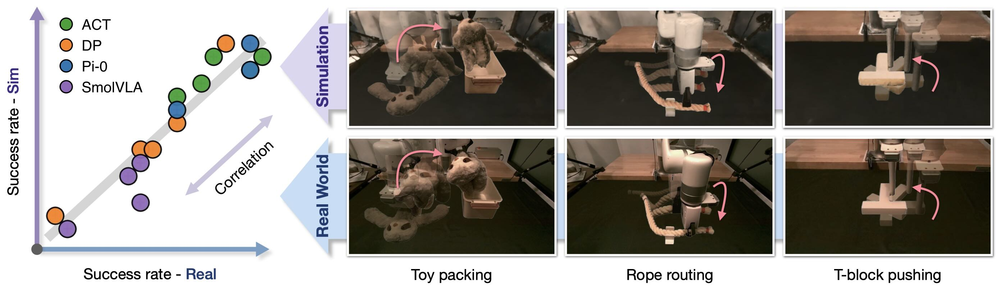

# Real-to-Sim Robot Policy Evaluation with Gaussian Splatting Simulation of Soft-Body Interactions

<span class="author-block"><a target="_blank" href="https://kywind.github.io/">Kaifeng Zhang</a><sup>1,2*</sup>,</span>
<span class="author-block"><a target="_blank" href="https://shuosha.github.io/">Shuo Sha</a><sup>1,2*</sup>,</span>
<span class="author-block"><a target="_blank" href="https://jianghanxiao.github.io/">Hanxiao Jiang</a><sup>1</sup>,</span>
<span class="author-block"><a target="_blank" href="https://scholar.google.com/citations?user=xokChDMAAAAJ&hl=en">Matthew Loper</a><sup>2</sup>,</span>
<span class="author-block"><a target="_blank" href="https://sites.google.com/nyu.edu/jay-hyunjong-song">Hyunjong Song</a><sup>2</sup>,</span>
<span class="author-block"><a target="_blank" href="https://guangyancai.me/">Guangyan Cai</a><sup>2</sup>,</span>
<span class="author-block"><a target="_blank" href="https://drzhuoxu.github.io/">Zhuo Xu</a><sup>3</sup>,</span>
<span class="author-block"><a target="_blank" href="https://scholar.google.com/citations?user=-MaXMRAAAAAJ&hl=en">Xiaochen Hu</a><sup>2</sup>,</span>
<span class="author-block"><a target="_blank" href="https://www.cs.columbia.edu/~cxz/">Changxi Zheng</a><sup>1,2</sup>,</span>
<span class="author-block"><a target="_blank" href="https://yunzhuli.github.io/">Yunzhu Li</a><sup>1,2</sup></span>

<span class="author-block"><sup>1</sup>Columbia University,</span>
<span class="author-block"><sup>2</sup>SceniX Inc.,</span>
<span class="author-block"><sup>3</sup>Google DeepMind,</span>
<span class="author-block"><sup>*</sup>Equal contribution. Work partially done while interning at SceniX Inc.</span>

### [Website](https://real2sim-eval.github.io/) | [ArXiv](https://arxiv.org/abs/2511.04665) | [Data&Ckpts](https://huggingface.co/collections/shashuo0104/real-to-sim-policy-eval)



## 1. Overview

This repository contains the official implementation of the **Real-to-Sim-Policy-Eval** framework. The main components are:

- Construct simulation assets: visualize object Gaussians, articulate robot Gaussians, define and render different object layouts.

- Deploy trained [PhysTwin](https://github.com/Jianghanxiao/PhysTwin) to simulate deformable object Gaussians.

- Train policies using the [policy_training](https://github.com/shuosha/policy_training) submodule located in ```policy/```.

- Evaluate policy in the constructed simulation environment.

- Interactive control of the Gaussian-based simulation. 

https://github.com/user-attachments/assets/a43362e9-26c6-48c5-8edd-8995c2c45c08

https://github.com/user-attachments/assets/e870efef-1974-45bc-ab9e-0c639238894a

## 2. Installation

### 2.1 Prerequisites

- This project uses [uv](https://docs.astral.sh/uv/), a fast Python package and project manager that serves as a lightweight replacement for Conda. A detailed uv tutorial is available [here](https://docs.astral.sh/uv/guides/install-python/#getting-started). You can also install all dependencies with Conda following similar steps.

- The installation has been tested with CUDA 12.8. The CUDA 12.8 installation guide is available [here](https://developer.nvidia.com/cuda-12-8-0-download-archive). If you use a different CUDA version, make sure to install PyTorch with the matching CUDA toolkit; otherwise, the build of ```diff-gaussian-rasterizer-w-depth``` may fail.

- GLM is required to compile ```diff-gaussian-rasterizer-w-depth```. Install it with: ```sudo apt-get update && sudo apt-get install -y libglm-dev```

- FFmpeg is required for policy rollout video generation. FFmpeg cannot be installed directly via uv, but you can install it either system-wide or through Conda. In the latter case, activate your Conda environment before activating the uv virtual environment.

### 2.2 Installation Steps 
```
# create and activate a python venv
uv venv --python=3.11
source .venv/bin/activate

# install main dependencies
uv pip install torch==2.7.1 torchvision==0.22.1 torchaudio==2.7.1 --index-url https://download.pytorch.org/whl/cu128
uv pip install -r pyproject.toml

# pull the policy submodule and install dependencies
git submodule update --init --recursive
cd policy
uv pip install -r pyproject.toml

# install Gaussian Splatting rasterizer
cd ../third-party/diff-gaussian-rasterization-w-depth
uv pip install --no-build-isolation -e .

# install a modified version of urdfpy to avoid version conflicts
cd ../urdfpy-0.0.22
uv pip install -e .

# return to the project home
cd ../..
```

## 3. Assets and Checkpoints

We provide the Gaussian Splatting assets, PhysTwin checkpoints, and the policy checkpoints we used in the paper on Huggingface. 


| Task                | Hugging Face Dataset Collection                                                                        |
| ------------------- | ------------------------------------------------------------------------------------------------------ |
| **Gaussian Splatting assets**    | [gs-scans](https://huggingface.co/shashuo0104/gs-scans)       |
| **PhysTwin checkpoints**    | [phystwin-toy](https://huggingface.co/shashuo0104/phystwin-toy), [phystwin-rope](https://huggingface.co/shashuo0104/phystwin-rope), [phystwin-T-block](https://huggingface.co/shashuo0104/phystwin-T-block)       |
| **Checkpoints**     | [see policy submodule README](https://github.com/shuosha/policy_training/blob/ceb025db01db539f3df954d6836cda2bd39d0ef3/README.md)         |

After downloading, extract the files to the following folders:
- Gaussian Splatting scans: ```log/gs/scans/```. E.g., there should be ```log/gs/scans/rope/```, ```log/gs/scans/sloth/```, etc.
- PhysTwin assets:  ```log/phystwin/<object_name>/```, and rename ```<object_name>``` to one of ```rope```, ```sloth```, ```T```. E.g., there should be ```log/phystwin/rope/data/```, ```log/phystwin/sloth/data/```, ```log/phystwin/T/data/```, etc.

- Policy checkpoints: ```log/policy_checkpoints/```. E.g., there should be ```log/policy_checkpoints/act-rope-routing/checkpoints/001000/``` (lerobot-style) and ```log/policy_checkpoints/pi0-rope-routing/10000/``` (openpi-style).


## 4. Run the code

### 4.1 Config structure

The config files of all the experiments are managed using ```hydra``` under ```cfg/```. The subfolders of the config, and their functionalities are listed follows:
- ```cfg/env```: camera intrinsics/extrinsics, robot model/initial poses, simulation duration, etc.
- ```cfg/gs```: object meshes, GS assets, poses, randomizations, etc.
- ```cfg/physics```: phystwin-related configs
- ```cfg/policy```: paths to policy and task configs for the ```policy/``` submodule
- ```cfg/renderer```: additional camera configs for GS rendering

### 4.2 Policy evaluation

Make sure you download the GS scans, PhysTwin checkpoints, and policy checkpoints for the corresponding task. Specify them in configs, for example, if you want to run the xarm-gripper environment with the rope GS assets, and using the rope PhysTwin, with pretrained ACT policy at iteration 7000, the command is:

```bash
CUDA_VISIBLE_DEVICES=0 python experiments/eval_policy.py \
gs=rope \
env=xarm_gripper \
physics.ckpt_path=log/phystwin/rope \
physics.case_name=rope_0001 \
policy.inference_cfg_path=policy/configs/inference/insert_rope.json \
policy.checkpoint_path=log/policy_checkpoints/act-rope-routing/checkpoints/007000
```

Execution-ready bash files are located in ```experiments/scripts/eval_policy```.

**Additional**: When multiple GPUs are available on a single node, episodes of policy evaluation can be distributed across multiple GPUs. For example, for the same evaluation as above but with 200 episodes and 8 GPUs, the parallelized launching script is:

```bash
CUDA_VISIBLE_DEVICES=0,1,2,3,4,5,6,7 python experiments/eval_policy_parallel.py \
gs=rope \
env=xarm_gripper \
physics.ckpt_path=log/phystwin/rope \
physics.case_name=rope_0001 \
policy.inference_cfg_path=policy/configs/inference/insert_rope.json \
policy.checkpoint_path=log/policy_checkpoints/act-rope-routing/checkpoints/007000 \
gs.use_grid_randomization=False \
policy.n_episodes=200
```

Execution-ready bash files are located in ```experiments/scripts/eval_policy_parallel```.

After running the evaluation, rollouts will be saved to ```log/experiments/output_eval_policy/``` by default. To visualize the start and end frames of each episode in a grid, use the visualization function provided by:

```bash
python experiments/utils/visualize_rollouts.py --data_dir log/experiments/output_eval_policy/<run_name>
```

You can calculate the success rates of each task by designing criterias based on simulation states, which are saved along with renderings in the policy rollout episodes. For the three tasks covered in our paper, the corresponding commands for calculating success rates are:
```bash
# rope routing
python experiments/utils/calculate_success_rope.py --data_dir log/experiments/output_eval_policy/<run_name>

# toy packing
python experiments/utils/calculate_success_sloth.py --data_dir log/experiments/output_eval_policy/<run_name>

# T-block pushing
python experiments/utils/calculate_success_T.py --data_dir log/experiments/output_eval_policy/<run_name>
```

### 4.3 Keyboard interactive control

```bash
CUDA_VISIBLE_DEVICES=0 python experiments/keyboard_teleop.py \
gs=rope \
env=xarm_gripper \
physics.ckpt_path=log/phystwin/rope \
physics.case_name=rope_0001
```

Execution-ready bash files are located in ```experiments/scripts/keyboard_teleop```.


### 4.4 Motion replay

In motion replay mode, instead of running a policy, we can simply read pre-computed trajectories (which may come from a real-world rollout) and follow the trajectories in sim. To test this function, download the sample replay data from [here](https://drive.google.com/file/d/184AcS8fUqnirwA2W0v6ne8i2pzOIeQ1w/view?usp=sharing). Then, extract the file into ```log/policy_rollouts/rope_act_7000/```, and the replay script is

```bash
CUDA_VISIBLE_DEVICES=0 python experiments/replay.py \
gs=rope \
env=xarm_gripper \
physics.ckpt_path=log/phystwin/rope \
physics.case_name=rope_0001 \
gt_dir=log/policy_rollouts/rope_act_7000
```

Execution-ready bash files are located in ```experiments/scripts/keyboard_teleop```.

### 4.5 Policy training

For policy training, please refer to the policy submodule README [here](https://github.com/shuosha/policy_training/blob/ceb025db01db539f3df954d6836cda2bd39d0ef3/README.md) for details.

## 5. Create custom assets

Creating an asset for this simulator includes the following steps:

### 5.1 Scanning

We use the [Scaniverse](https://scaniverse.com/) app for Gaussian Splatting reconstruction in all our experiments. It is possible to use any Gaussian Splatting training tools, as long as the checkpoints/reconstructions are saved as [the PLY format](https://developer.playcanvas.com/user-manual/gaussian-splatting/formats/ply/).

### 5.2 Positional alignment

We use the [SuperSplat](https://superspl.at/editor/) interactive editor for positional alignment (cropping, scaling, rotating, translating). The goal is to make Gaussians of individual objects match their corresponding mesh files. The alignment between Gaussians and mesh vertices can be checked using
```bash
python assets/scans/visualize_scan.py --gs_path path/to/ply/file
```
after exporting the modified Gaussians from SuperSplat as PLY format.

For positionally aligning the background scans (including the robot), we use SuperSplat to make the robot orientations and scene origins roughly align with the orientation and origins of the robot URDF file, respectively. Then, fine-grained robot point ICP alignment and robot segmentation is done by
```bash
# for xarm7 robot with gripper; if you downloaded our gs scans, 
# no need to run these as the scans have already been processed; 
# for new scenes, change the paths and robot bounding box extents 
# in construct_scene_gripper.py first
python assets/scans/construct_scene_gripper.py --construct  # run ICP, get aligned robot GS
python assets/scans/construct_scene_gripper.py --visualize  # visualize the results

# for xarm7 robot with pusher; if you downloaded our gs scans, 
# no need to run these as the scans have already been processed; 
# for new scenes, change the paths and robot bounding box extents 
# in construct_scene_pusher.py first
python assets/scans/construct_scene_pusher.py --construct  # run ICP, get aligned robot GS
python assets/scans/construct_scene_pusher.py --visualize  # visualize the results
```

### 5.3 Color alignment

To align the color between raw GS renderings and the desired color space (e.g., images from real-world cameras), we use a quadratic RGB color transformation. First, collect paired sim-real (source-reference) images. Sample images can be downloaded from [here](https://drive.google.com/file/d/1qjlfZsGUb-c6AikcuPxxlOlKmZxvQKnM/view?usp=sharing), and extracted into ```log/color_alignment```. Then, the transformation can be estimated by

```bash
python assets/scans/color_alignment.py  # change paths in file for your custom data
```

### 5.4 PhysTwin training

Please refer to the original [PhysTwin](https://github.com/Jianghanxiao/PhysTwin) codebase for phystwin training. After the training, within the saved checkpoint, the required files are:

- ```data/<case_name>/final_data.pkl```
- ```experiments/<case_name>/train/best_xxx.pth```
- ```experiments_optimization/<case_name>/optimal_params.pkl```

After saving the checkpoints, specify the path to the checkpoint as ```ckpt_path``` in ```cfg.physics```.

**Special case.** If you wish to create phystwins of rigid objects, we provide a easy script that samples points uniformly inside mesh and connect dense high-stiffness springs to form a rigid digital twin. The following command uses T-block as example (suppose you already have the mesh model of the object):
```bash
python experiments/utils/create_rigid_phystwin.py \
--rigid_mesh_path experiments/log/gs/scans/T/T_mesh.ply \
--ckpt_path experiments/log/phystwin/T \
--case_name T_0001 \
--cfg_path experiments/cfg/physics/default.yaml
```

## 6. Release plan

- [x] Initial release: sim engine, Gaussian Splatting, policy training, policy evaluation, keyboard teleoperation
- [ ] More object scans
- [ ] PhysTwin training
- [ ] Gello teleoperation
- [ ] More robot embodiments
- [ ] Integration with mainstream simulation platforms

## 7. Citation

If you find this repo useful, please consider citing the paper
```
@article{zhang2025real,
    title={Real-to-Sim Robot Policy Evaluation with Gaussian Splatting Simulation of Soft-Body Interactions},
    author={Zhang, Kaifeng and Sha, Shuo and Jiang, Hanxiao and Loper, Matthew and Song, Hyunjong and Cai, Guangyan and Xu, Zhuo and Hu, Xiaochen and Zheng, Changxi and Li, Yunzhu},
    journal={arXiv preprint arXiv:2511.04665},
    year={2025}
}
```
